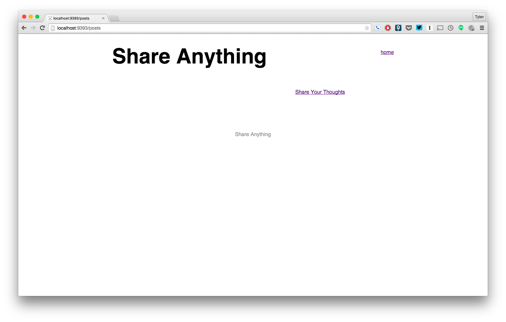
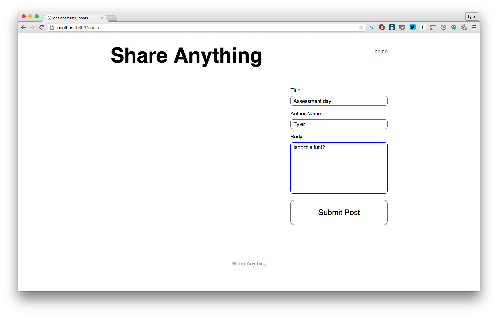
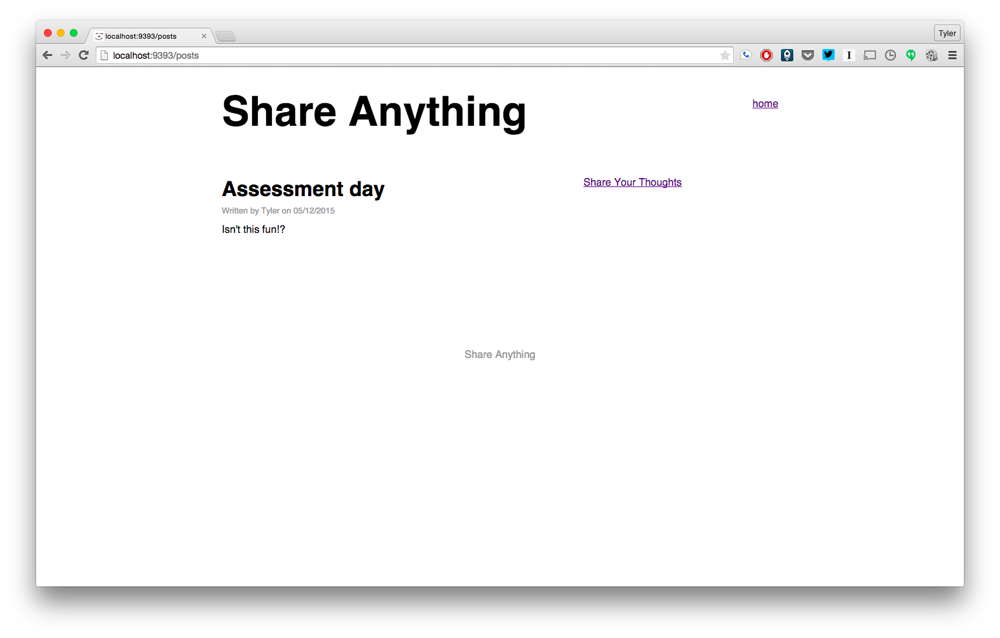

# Part 2:  AJAX

## Summary
In Part 2 we'll take a functioning Sinatra application and enhance the user experience by adding some AJAX calls.

### User Stories
**Current Site**.  The application is a simple site where users can write posts.  If a user wanted to write a post, here's the process.

1. User visits the site root.
2. User clicks on the "Share Your Thoughts" link.
3. User is taken to a new page with a form.
4. User fills out and submits the form.
5. User is taken to a new page where the saved post is displayed.

**Future Site**. Our enhancements will make it so the user never leaves the homepage.  All the requests will be AJAX requests, and we'll update the DOM based on the responses.  After the site is updated, here's what the user experience will be.

1. User visits the site root.
2. User clicks on the "Share Your Thoughts" link.
3. The link is no longer visible on the page.
4. In place of the link is the form for writing a new post.
5. User fills out and submits the form.
6. Details of the saved post are added to the DOM.
7. The form is removed from the DOM.
8. The "Share Your Thoughts" link is again visible.

### Testing
Feature tests are provided in Part 2 of the assessment to guide our enhancement efforts. These types of tests might be unfamiliar.  We don't need to understand how to set up or write such tests.  We'll just use them as a guide.

## Releases
### Pre-release:  Setup
We'll need to make sure that everything is set up before we begin working on the application.  From the command line, navigate to the `part-2` directory of the phase 2 assessment.  Once there, run ...

0. `$ brew update && brew uninstall --force phantomjs; brew install phantomjs`
0.  Ensure the installation worked. If not **ask for help**. Executing `phantomjs -v` should return a version number greater than 2.1 (e.g. 2.1.0, 2.1.1, 2.2, 2.3, etc.)
0. `$ bundle`
0. `$ bundle exec rake db:create`
0. `$ bundle exec rake db:migrate`
0. `$ bundle exec rake db:migrate RACK_ENV=test`

### Release 0: AJAX
Now we'll take our application and enhance its functionality.  But, we don't want to break our functioning site in the process.  Fortunately, there are tests to help us.  Tests have been written to describe the `Post` class (see `spec/models/post_spec.rb`) and the feature of writing a new post (see `spec/features/writing_a_post_spec.rb`).

The feature tests for writing a new post include two contexts:  without javascript and with javascript.  The code you are provided with will pass the scenario where javascript is not being used.  The with-javascript scenario fails with just the provided code.

Our task is to make the with-javascript scenario pass.  When our site is functioning properly with AJAX, both scenarios should pass.  Don't break the without-javascript test to pass the with-javascript test.

To run the tests and see the with-javascript feature test fail, from the command line, run ...

```
$ bundle exec rspec
```

Use the failing scenario and future-site user story from the *Summary* to guide your development until all the tests pass.

## Conclusion
Once all the tests have passed, you have completed Part 2 of the assessment. If you haven't done so already, commit your changes and move on to Part 3.

## Screenshot Walkthrough

Starting out, things are pretty normal.



After clicking the "Share Your Thoughts" link, we should see the form (note: we don't have the header from the normal new post page).



Once we submit, our form goes away but we should have the post shown on the page.


