# Part 3: Build a CRUD App

## Summary

In Part 3 of the assessment, we'll demonstrate our proficiency in building
web-stack applications: user authentication, associations, validations,
controllers, views, etc. Even a little bit of CSS.

### Site Overview

We'll be building a simplified version of a blind auction site. In a blind
auction, bidders do not see how much other bidders have bid.

The required functionality of the site will be described in more detail in the
*Releases* section, but here's a basic overview.

#### All Users

- Browse available items

#### Unregistered Users**

- Register a new account

#### Registered Users

- Sign in
- Sign out
- List new items
- Place bids on items
- Have a profile showing their listing and bidding activity

### Completing the App

Complete as much of this CRUD app as possible in the time allowed.  If time is
running out and it looks like the app will not be completed, continue to work
through the releases in order and complete as much as possible. Be sure to ask
questions, if you find yourself stuck.

## Releases
### Pre-release:  Setup
We'll need to make sure that everything is set up before we begin working on the application.  From the command line, navigate to the `part-3` directory of the phase 2 assessment.  Once there, run ...

0. `$ bundle`
0. `$ bundle exec rake db:create`

_NOTE_: In the mockups below the URLs are omitted. You should determine the
appropriate path(s) based on conventions / patterns you have learned about
in Phase 2.

### Release 0: User Registration

Users will need to register for a new account. Create a link on the home page
that will take them to a page where they can enter their desired username,
email, and password. The username must be unique.

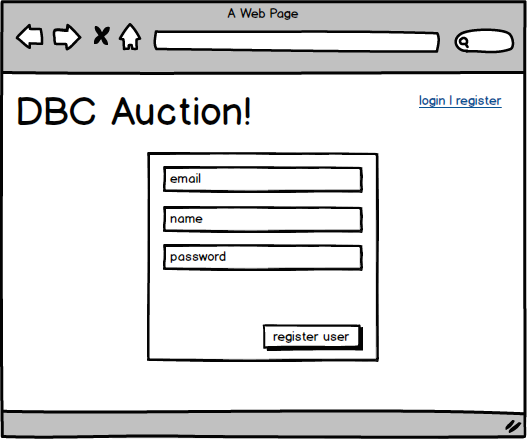

If both constraints are met, the user should be considered logged in and
redirected to the home page where all references to "Register" are removed.

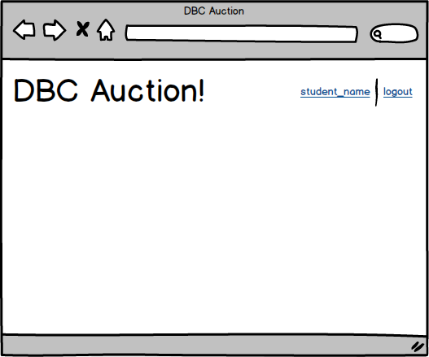

If either constraint is not met, the user should see the registration form and
the associated error messages.

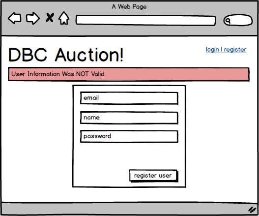

### Release 1: Login/Logout

#### Login

_Given:_

* There is a previously registered user
* User is not currently logged in:

1. On the home page, create a link to login.
1. When a user clicks on this link they should be taken to a page with a form to
   enter their credentials.

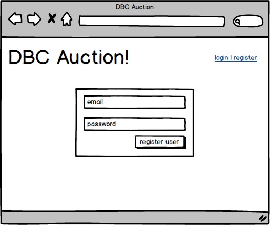

1. If the credentials match, the user should be taken back to the homepage and the
   login link should be replaced with a logout link.

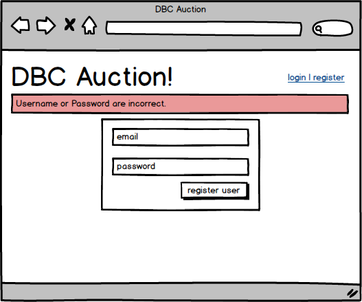

1. If the credentials do not match, the user should see the login form and an
   error message stating the credentials were not valid.

#### Logout

Given there is a previously registered user and they are currently logged in:

1. On the home page, create a link to logout.
1. When the user clicks on the logout link they should be taken to the home page
   and the links "Register" and "Login" should both be visible.

### Release 2: CRUD'ing a Resorouce

The user's profile page is where users are able to manage their listed items.
We'll start off by giving them the ability to add an item and then work through
the remaining CRUD actions.

#### Creating Items

_Given:_

* The registered user is signed in:

1. On the home page create a link to the user's profile page.
1. When the user clicks on the profile link they should be taken to their profile page.

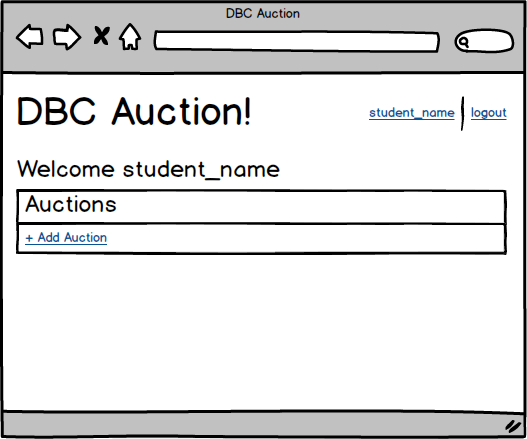

1. Create a link on this page to add an item to the auction site. The item
   should include things like a name and/or title, description, when the user
   would like the auction to start and when it should stop.

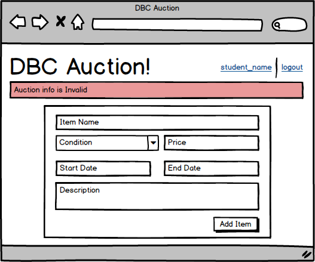

*Note*: When creating and or editing an item, you'll need to create forms that
allow you to enter dates. The HTML5 datetime input type is tricky to use with
ActiveRecord. Consider using something like `<input type="text"
name="my-date">` in the markup. When filling in the field, use the `YYYY-MM-DD`
or `YYYY-MM-DD HH:MM:SS` format (e.g. 2015-04-01 14:30:00).

After submitting an item, the user should be back on their profile page.

#### Reading Items

_Given:_

* The registered user is signed in
* There exist previously-created items

1. Create a section on the profile page to display all the items. This section
   should _not_ include the long form description of the item.

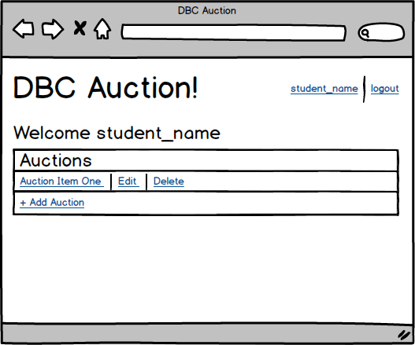

#### Updating Items

_Given:_

* The registered user is signed in
* There exist previously-created items; some owned by the logged-in user,
  others not

1. On the profile page, create an edit link associated to each of the items the
   user has created. This link should only be visible if the user logged in is the
   user that created the item. For example, if Eve is visiting Bob's profile, she
   should not be able to edit Bob's items.
1. When the user clicks the edit link associated to the item, they should be
   taken to a page to edit that item's details. After submitting this information
   the user should be taken back to their profile page and see the item's updates
   should be reflected on the page.

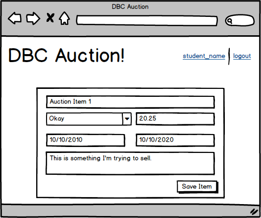

#### Deleting Items

_Given_

* The registered user is signed in
* There exist previously-created items; some owned by the logged-in user,
  others not

1. On the profile page, create a delete button associated to each of the items
   the user has created. Just like in the update section, this button should only be
   visible if the user logged in is the user that created the item.
1. When the user clicks the delete button, the user profile page should reload and
   the item should no longer be visible.

### Release 3: Bidding

Up until now, the home page has largely just contained links to allow the user
to register or login, or if they were logged in, to logout. Now that users have
the ability to create items for others to bid on, let's start filling in the
homepage.

#### Viewing Active Items

_Given_

* The registered user is signed in
* There exist previously-created items; some owned by the logged-in user,
  others not
* There exist items which are active

Create a section on the home page to list the items that are currently
available and active. To clarify, active means the items have start date on or
before today and the end date is on or after today.

#### Creating a Bid

_Given_

* The registered user is signed in
* There exist previously-created items; some owned by the logged-in user,
  others not
* There exist items which are active

1. Make the name or title of the listed items in the home page a link. When the
user clicks on a link for an item, they should be on a page that is displaying
the details of the item. This will include the long form description and add a
section on the page to display the current number of bidders.

1. Add a form to the item detail page that will allow the user to enter a bid
amount. The submit button for the form should say "Place Bid".

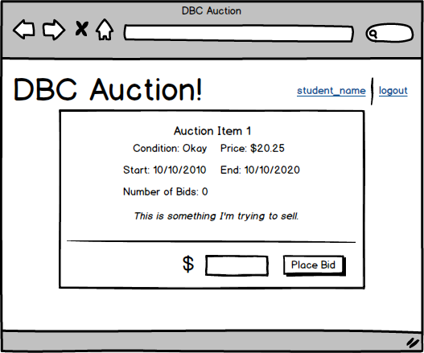

1. When the user submits the bidding form, the page should reload. Where the
form was located, there should be the text, "Thank you for your bid. Good luck!"
and the number of bidders section should be incremented by 1.

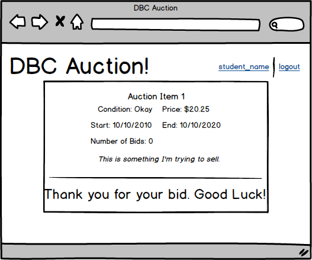

#### Login or Register to Bid

_Given:_

* The current user is not logged in
* The user is on the item details page for a previously-created item

In place of the bidding form, a user should see the text "To place a bid please login or register." Both login and register should be links taking the user to
their respective pages.

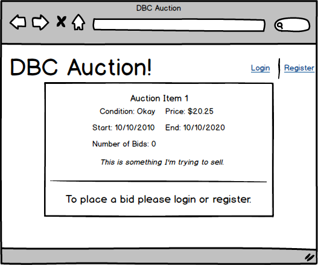

### Release 4: Bid on Items on the Profile Page

Now that we can bid on items, let's make it easy to keep track of the things we
have bid on.

#### Bid on Items

_Given:_

* The registered user is logged in
* Registered user has previously placed bids on several items
* User is currently on their profile page

Create a section to display the items the user has bid on.

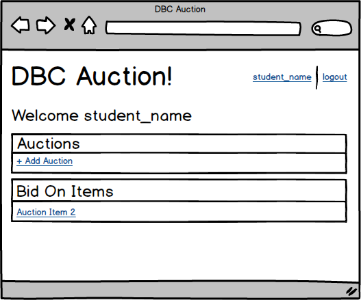

#### Won Items

_Given:_

* The registered user is logged in
* The registered user placed the highest bid on several items that are no longer active
* The registered user is currently on their profile page

Create a section to display the items they have won. This is items that are no
longer active (end date is before today) and the bid placed on the item is the
highest of all the bidders.

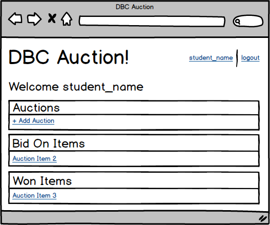

## Conclusion

Part-3 wraps up the assessment.  If you haven't already done so, commit your
changes.  Please wait until the end of the assessment period to submit your
solution.
